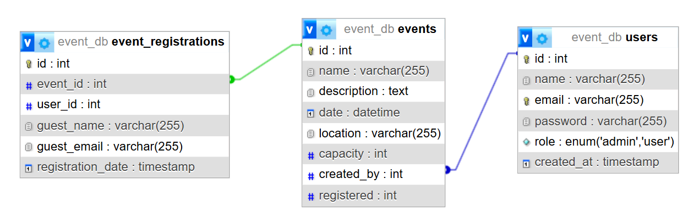

## Live Link
Link : https://ollyo-ems.onrender.com

****N:B:*** Due to ***Render***'s policy, this free instance will spin down with inactivity, which can delay requests by 50 seconds or more.*

```
# Admin
- Email : admin@admin.com
- pass : 123456789

# User
- Email : user@user.com
- pass : 123456789
```
API endpoint : `http://localhost/Ollyo-EMS/api/event_details.php?event_id=eventid`

## Database Diagram


## Setup Guide
This applicaton already hosted on ***Render***. But in case of local setup, follow the follwing guidelines:
1. To develop this project following technologies are used:
    ```
    php-8.3.11
    mysql-8.0.30
    apache-2.0
    ```
    You can install those as a bundle with ***Laragon*** or ***XAMPP***.

2. Place the project on root folder of your server.

3. Create a databse on mysql as follows:
```
CREATE TABLE `users` (
    `id` INT NOT NULL AUTO_INCREMENT,
    `name` VARCHAR(255) NOT NULL,
    `email` VARCHAR(255) NOT NULL UNIQUE,
    `password` VARCHAR(255) NOT NULL,
    `role` ENUM('admin', 'user') DEFAULT 'user',
    `created_at` TIMESTAMP DEFAULT CURRENT_TIMESTAMP,
    PRIMARY KEY (`id`)
);


CREATE TABLE `events` (
    `id` INT NOT NULL AUTO_INCREMENT,
    `name` VARCHAR(255) NOT NULL,
    `description` TEXT,
    `date` DATETIME NOT NULL,
    `location` VARCHAR(255) DEFAULT NULL,
    `capacity` INT NOT NULL,
    `created_by` INT DEFAULT NULL,
    `registered` INT DEFAULT 0,
    PRIMARY KEY (`id`),
    FOREIGN KEY (`created_by`) REFERENCES `users`(`id`) ON DELETE SET NULL
);

CREATE TABLE `event_registrations` (
    `id` INT NOT NULL AUTO_INCREMENT,
    `event_id` INT NOT NULL,
    `guest_name` VARCHAR(255) DEFAULT NULL,
    `guest_email` VARCHAR(255) NOT NULL,
    `registration_date` TIMESTAMP NULL DEFAULT CURRENT_TIMESTAMP,
    PRIMARY KEY (`id`),
    UNIQUE KEY `unique_event_guest` (`event_id`, `guest_email`), -- Ensures one email per event
    CONSTRAINT `fk_event` FOREIGN KEY (`event_id`) REFERENCES `events` (`id`) ON DELETE CASCADE
);
```

4. Create a `.env` file on the project root. Add the following credential with your own:
    ```
    DB_HOST=
    DB_PORT=
    DB_NAME=
    DB_USER=
    DB_PASS=
    ```

5. Ok, you are good to go. Nevigate to `http://localhost/Ollyo-EMS`. You should see the home page.